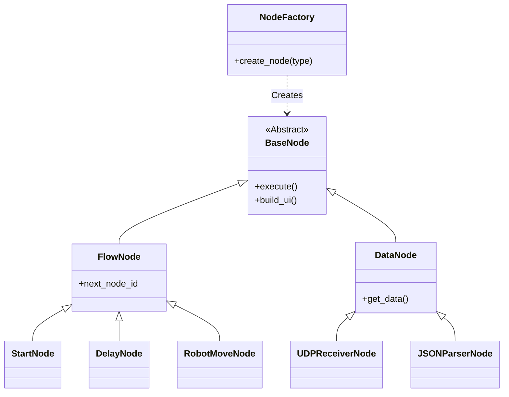

# PyGui Visual Scripting Tool for Robot Control

> **"From Passive Monitor to Active Visual Editor"** > 로봇 제어 로직을 노드(Node) 기반으로 시각화하고 편집할 수 있는 비주얼 스크립팅 도구입니다.

---

## Project Overview (개요)

본 프로젝트는 **[MT4 Robot Arm Control System]**의 제어 및 모니터링을 위해 개발된 **Side Project**입니다.

초기에는 단순한 데이터 모니터링 대시보드로 시작하였으나, 사용자가 직접 제어 로직(Sequence)을 설계하고 하드웨어와 통신 흐름을 제어할 수 있도록 **노드 기반 비주얼 에디터(Node-based Visual Editor)**로 고도화되었습니다.

### Key Objectives

* **Visual Programming:** 복잡한 파이썬 코드 없이 노드 연결만으로 로봇 제어 로직 설계
* **Modular Architecture:** 통신(UDP), 파싱(JSON), 제어(Serial) 기능을 독립적인 노드로 모듈화
* **Cross-Platform:** PC(Windows) 및 임베디드 환경(Raspberry Pi 5)에서 동일하게 동작

---

## Project Relationship (프로젝트 관계도)

이 도구는 로봇 하드웨어 시스템의 **소프트웨어 제어부** 역할을 담당합니다.

* **Main Hardware Repo:** [Robot Arm System (Unity + Arduino)]
* *역할:* 로봇 기구학(IK) 연산, 물리 엔진 시뮬레이션 (Unity), 모터 제어


* **This Repo:** **PyGui Visual Scripting Tool**
* *역할:* 제어 패널, 비주얼 스크립팅, 데이터 로깅, 통신 중계


---

## System Architecture (시스템 구조)

본 프로젝트는 **확장성(Extensibility)**과 **유지보수성(Maintainability)**을 위해 **Factory Method Pattern**을 적용하여 설계되었습니다.

### 1. Class Diagram

GUI의 노드(Node)와 내부 로직(Logic)이 1:1로 매핑되는 구조를 가집니다.



### 2. Design Patterns

* **Factory Method Pattern:** 새로운 기능(노드) 추가 시 기존 코드를 수정하지 않고 공장 클래스만 확장하여 **OCP(Open-Closed Principle)**를 준수합니다.
* **Event-Driven Architecture:** 노드 간의 연결(Link)과 실행(Execute)이 이벤트 기반으로 동작합니다.

---

## Features (주요 기능)

### 1. Visual Scripting Engine

* **Drag & Drop:** 노드를 생성하고 마우스 드래그로 실행 흐름(Flow) 연결
* **Dynamic Linking:** 런타임 중 노드 연결/해제 및 로직 변경 가능
* **Clean UI:** Dear PyGui 기반의 가볍고 직관적인 인터페이스 (한글 지원)

### 2. Supported Nodes (구현 및 예정)

| Category | Node Name | Description | Status |
| --- | --- | --- | --- |
| **Flow** | `START` | 로직 실행의 시작점 | ✅ Done |
| **Flow** | `DELAY` | 지정된 시간만큼 대기 (Sequence 제어) | ✅ Done |
| **Action** | `PRINT` | 디버깅용 메시지 출력 | ✅ Done |
| **Action** | `ROBOT_MOVE` | 로봇을 특정 좌표(G-code)로 이동 | 🚧 In Progress |
| **Data** | `UDP_RECV` | Unity로부터 패킷 수신 | 🚧 In Progress |
| **Data** | `JSON_PARSE` | 수신된 데이터를 좌표값으로 변환 | 🚧 In Progress |

---

## Getting Started

### Prerequisites

* Python 3.8+
* Raspberry Pi 5 (Recommended) or PC

### Installation

```bash
# 1. Clone the repository
git clone https://github.com/khw18033/PyGui-Visual-Scripting.git
cd PyGui-Visual-Scripting

# 2. Install dependencies
pip install dearpygui pyserial
# (For Raspberry Pi, you might need: --break-system-packages)

# 3. Install Korean Fonts (For Linux/Raspi)
sudo apt install fonts-nanum

```

### Usage

```bash
python3 visual_scripting_base.py

```

---

## Roadmap

* [x] **Phase 1:** 비주얼 스크립팅 엔진 코어 구현 (Node, Link, Execution)
* [ ] **Phase 2:** 통신 모듈(UDP/Serial) 노드화 및 Unity 연동
* [ ] **Phase 3:** 로봇 제어 명령(G-code) 생성 로직 구현
* [ ] **Phase 4:** 저장/불러오기(Save/Load) 기능 추가

---

## License

This project is licensed under the MIT License.

---

### Author

* **Hyunwoo Kim** (Department of Computer Engineering, Hanbat National Univ.)
* GitHub: [@khw18033](https://www.google.com/search?q=https://github.com/khw18033)