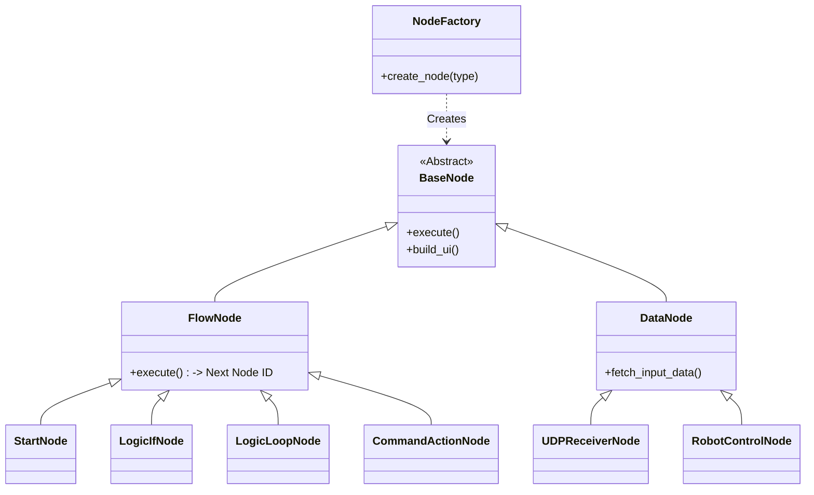

# PyGui Visual Scripting Tool for Robot Control (v20)

> **"From Passive Monitor to Active Visual Editor"** > 로봇 제어 로직을 노드(Node) 기반으로 시각화하고 편집할 수 있는 강력한 하이브리드 비주얼 스크립팅 도구입니다.

---

## Project Overview (개요)

본 프로젝트는 **[MT4 Robot Arm Control System]**의 제어 및 모니터링을 위해 개발된 **소프트웨어 제어부(Software Control Panel)**입니다.

초기에는 단순한 데이터 모니터링 대시보드로 시작하였으나, 사용자가 직접 제어 로직(Sequence)을 설계하고 하드웨어와 통신 흐름을 제어할 수 있도록 **노드 기반 비주얼 에디터(Node-based Visual Editor)**로 고도화되었습니다. **최신 v20 버전**에서는 스크래치(Scratch)와 같은 분기문(If)과 반복문(Loop)을 지원하는 스마트 실행 엔진이 탑재되었습니다.

### Key Objectives

* **Visual Programming:** 복잡한 파이썬 코드 수정 없이 노드 연결만으로 로봇 제어 로직 및 조건부 행동 설계
* **Hybrid Execution Engine:** 순차적인 데이터 흐름(Data Flow)과 조건에 따른 실행 분기(Execution Branching)를 동시 지원
* **Digital Twin Sync:** Unity 3D 환경과 UDP 통신을 통한 실시간 양방향 동기화 및 텔레프레즌스 제어
* **Cross-Platform:** PC(Windows/Mac) 및 임베디드 환경(Raspberry Pi 5)에서 동일하게 동작

---

## System Architecture (시스템 구조)

본 프로젝트는 **확장성(Extensibility)**과 **유지보수성(Maintainability)**을 위해 **Factory Method Pattern**을 적용하여 설계되었습니다.

### 1. Class Diagram

GUI의 노드(Node)와 내부 로직(Logic)이 1:1로 매핑되는 구조를 가집니다.



### 2. Design Patterns

* **Factory Method Pattern:** 새로운 기능(노드) 추가 시 기존 코드를 수정하지 않고 공장 클래스만 확장하여 **OCP(Open-Closed Principle)**를 준수합니다.
* **Lazy Evaluation (지연 평가):** 조건문(IF) 실행 시 연결된 상태 판단 노드를 즉시 재계산하여, 프레임 지연 없는 정확한 분기 제어를 수행합니다.

---

## Supported Nodes (v20 최종 구현 완료 노드)

총 14개의 노드가 지원되며, 이를 조합하여 무한한 제어 시나리오를 만들 수 있습니다.

### 🔀 Flow & Logic (흐름 및 논리 제어)

| Node Name | Type Code | Description |
| --- | --- | --- |
| **START** | `START` | 로직 실행의 시작점 (엔진 트리거) |
| **Logic: IF** | `LOGIC_IF` | 조건(True/False)에 따라 실행 흐름을 두 갈래로 분기 |
| **Logic: LOOP** | `LOGIC_LOOP` | 지정된 횟수만큼 흐름을 반복 실행 (For Loop) |

### ❓ Condition (조건 판단)

| Node Name | Type Code | Description |
| --- | --- | --- |
| **Check: State** | `COND_COMPARE` | 로봇의 현재 좌표(X,Y,Z)나 그리퍼 상태를 특정 값과 비교 |
| **Check: Key** | `COND_KEY` | 키보드의 특정 키 입력 여부 감지 |

### 🤖 Action & Hardware (행동 및 하드웨어 제어)

| Node Name | Type Code | Description |
| --- | --- | --- |
| **Command Action** | `CMD_ACTION` | 로봇을 이동(상대/절대)시키거나 그리퍼 조작, 호밍 수행 |
| **Robot Driver** | `ROBOT_CONTROL` | 스무딩(Smoothing)이 적용된 G-code를 생성하여 하드웨어로 전송 |
| **Keyboard (Pi)** | `KEYBOARD` | 키보드(WASD/QE/UJ) 입력을 로봇 이동 좌표로 변환 |
| **Unity Logic** | `UNITY_CONTROL` | Unity에서 수신된 JSON 패킷을 로봇 제어 좌표로 변환 |

### 📊 Data & Tools (데이터 처리 및 모니터링)

| Node Name | Type Code | Description |
| --- | --- | --- |
| **UDP Receiver** | `UDP_RECV` | Unity로부터 패킷 수신 및 로봇 피드백 송신 |
| **Constant** | `CONSTANT` | 고정된 숫자(상수) 데이터를 제공 |
| **Live Graph** | `GRAPH` | 로봇의 XYZ 좌표 변동을 실시간 그래프로 시각화 |
| **System Log** | `LOGGER` | 시스템 이벤트 및 동작 히스토리를 텍스트로 출력 |
| **Print Log** | `PRINT` | 연결된 데이터 값을 콘솔에 출력 (디버깅용) |

---

## Getting Started

### Prerequisites

* Python 3.8+
* Raspberry Pi 5 (Recommended) or PC Desktop

### Installation

```bash
# 1. Clone the repository
git clone https://github.com/khw18033/PyGui-Visual-Scripting.git
cd PyGui-Visual-Scripting

# 2. Install dependencies
pip install dearpygui pyserial
# (For Raspberry Pi, you might need: --break-system-packages)

# 3. Install Korean Fonts (For Linux/Raspi)
sudo apt install fonts-nanum

```

### Usage

```bash
# 최신 통합 버전 실행
python3 visual_scripting_v20.py

```

---

## Roadmap & Status

* [x] **Phase 1:** 비주얼 스크립팅 엔진 코어 구현 (Node, Link, Execution)
* [x] **Phase 2:** 통신 모듈(UDP/Serial) 노드화 및 Unity 연동 완료
* [x] **Phase 3:** 로봇 제어 명령(G-code) 생성 및 스무딩 모션 적용
* [x] **Phase 4:** 작성한 노드 그래프의 파일 저장/불러오기(Save/Load) 기능
* [x] **Phase 5 (v20):** 제어 로직 모듈화 (조건문 IF, 반복문 LOOP 기능 탑재)

---

## License

This project is licensed under the MIT License.

---

### Author

* **Hyunwoo Kim** (Department of Computer Engineering, Hanbat National Univ.)
* GitHub: [@khw18033](https://www.google.com/search?q=https://github.com/khw18033)