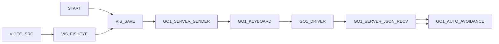

# 참고용 PyGui GO1 Avoid 작동 로직 분석

이 문서는 PyGui에서 Go1 카메라 이미지 서버 송출 + 서버로부터 전달받은 json 파일을 기반으로 회피하는 로직이 어떤 흐름으로 동작하는지 정리한 것이다. 이 로직은 크게 두 축으로 나뉜다.

1. 카메라 프레임 수집, 저장, 업로드 축
2. 조종 입력, 서버 JSON 수신, 자동 회피 축

두 축은 서로 독립적으로 시작되지만, 최종적으로는 같은 Go1 전역 제어 상태를 공유한다. 즉, 키보드 입력, 서버 JSON, 자동 회피가 모두 같은 로봇 동작 변수에 영향을 준다.

## 전체 흐름

실제 의미는 다음과 같다.

- `START`는 저장 파이프라인의 시작점이다.
- `VIDEO_SRC`는 Go1 카메라 프레임을 읽는다.
- `VIS_FISHEYE`는 프레임 보정/크롭을 담당한다. (실제 작동 시엔 OFF 상태, 필요한 경우 기능을 ON으로 변경하여 사용)
- `VIS_SAVE`는 프레임을 폴더에 저장한다.
- `GO1_SERVER_SENDER`는 저장된 이미지를 원격 서버로 업로드한다.
- `GO1_KEYBOARD`는 키 입력으로 이동 명령을 만든다.
- `GO1_DRIVER`는 로봇 이동 명령의 중심 제어 노드다.
- `GO1_SERVER_JSON_RECV`는 원격 서버 JSON을 폴링해서 방향 명령과 탐지 결과를 받아온다.
- `GO1_AUTO_AVOIDANCE`는 수신된 탐지 결과를 바탕으로 회피/정지 동작을 결정한다.

## 노드별 역할

| 노드 | 역할 | 주요 입력 | 주요 출력 | 비고 |
| --- | --- | --- | --- | --- |
| START | 그래프 진입점 | 없음 | flow | 저장 체인의 첫 흐름을 연다 |
| VIDEO_SRC | 카메라 프레임 수집 | 없음 | frame | `receiver_folder`에서 안정된 최신 프레임을 읽는다 |
| VIS_FISHEYE | 렌즈 보정 및 크롭 | frame | frame | 현재 설정에서는 `enabled=false`, `crop_enabled=false`라 사실상 통과 노드에 가깝다 |
| VIS_SAVE | 프레임 저장 | flow, frame | flow | 저장 폴더에 JPEG를 기록한다 |
| GO1_SERVER_SENDER | 이미지 업로드 시작/중지 | flow | flow | 저장 폴더를 감시하며 서버 업로드 스레드를 시작한다 |
| GO1_KEYBOARD | 키보드 기반 이동 입력 | flow | vx, vy, vyaw, body_height, flow | WASD 모드 기준으로 이동 벡터를 만든다 |
| GO1_DRIVER | Go1 주행 제어 | vx, vy, vyaw, body_height | flow | 전역 `go1_node_intent`에 최종 속도를 반영한다 |
| GO1_SERVER_JSON_RECV | 서버 JSON 수신 | flow | raw_json, seq, ts, vx, vy, wz, stop, confidence, connected, fresh, status, flow | HTTP 폴링으로 서버 상태와 방향 명령을 읽는다 |
| GO1_AUTO_AVOIDANCE | 자동 회피 | json, flow | status, has_near_obstacle, near_count, person_found, person_id, person_rel_depth, flow | 가까운 사람/장애물을 보고 회피 또는 정지시킨다 |

## 현재 그래프의 실제 연결 의미

### 1. 저장 및 업로드 체인

`START -> VIS_SAVE -> GO1_SERVER_SENDER`

이 체인은 로봇 제어와는 별개로, 카메라 영상을 저장하고 서버로 올리는 역할을 한다.

- `VIDEO_SRC`가 프레임을 공급한다.
- `VIS_FISHEYE`가 프레임을 보정한다.
- `VIS_SAVE`가 저장을 담당한다.
- `GO1_SERVER_SENDER`는 저장된 이미지를 원격 서버로 보내는 업로드 매니저 역할을 한다.

그래프상으로는 `GO1_SERVER_SENDER`가 flow를 다음 노드로 넘기지만, 실제 핵심 기능은 업로드 스레드의 시작/정지 관리다.

### 2. 조종 체인

`GO1_KEYBOARD -> GO1_DRIVER -> GO1_SERVER_JSON_RECV -> GO1_AUTO_AVOIDANCE`

이 체인은 로봇을 움직이게 만드는 핵심 제어 경로다.

- `GO1_KEYBOARD`는 키 상태에 따라 `vx`, `vy`, `vyaw`를 만든다.
- `GO1_DRIVER`는 이 값을 전역 제어 상태 `go1_node_intent`에 반영한다.
- `GO1_SERVER_JSON_RECV`는 서버에서 내려오는 JSON을 읽고, 방향 명령이 있으면 짧은 이동 명령으로 변환할 수 있다.
- `GO1_AUTO_AVOIDANCE`는 서버 JSON 내부의 탐지 결과를 해석해 근접 사람/장애물을 보면 회피 방향을 결정하거나 정지 명령을 보낸다.

### 3. 자동 회피의 실제 작동 방식

`GO1_AUTO_AVOIDANCE`는 단순히 상태를 표시하는 노드가 아니다. `GO1_SERVER_JSON_RECV`가 마지막으로 읽은 JSON을 받아 다음을 수행한다.

- `has_near_obstacle`가 false면 안전 상태로 간주한다.
- `detections` 안에서 `risk_level=near`인 객체를 찾는다.
- 그중 `person`이 있으면 사람 중심으로 회피 방향을 계산한다.
- 사람의 bbox 중심이 화면 왼쪽 또는 가운데면 오른쪽으로 피하고, 오른쪽이면 왼쪽으로 피한다.
- 회피 불가능하거나 bbox 정보가 없으면 즉시 정지 명령을 보낸다.

즉, 이 노드는 서버가 제공하는 인식 결과를 실제 주행 명령으로 변환하는 안전 계층이다.

## 세부 노드 동작

아래 세 노드는 이 그래프의 실제 반자동/안전 동작을 결정하는 핵심이다.

### GO1_SERVER_SENDER: 저장된 프레임을 서버로 업로드하는 노드

이 노드는 로봇을 직접 움직이지 않는다. 대신 `VIS_SAVE`가 저장한 이미지를 원격 서버에 전송하기 위한 비동기 업로드 관리 노드다.

#### 통신 방법

- 전송 프로토콜: HTTP
- 요청 방식: `POST`
- 전송 형식: `multipart/form-data`
- 사용 라이브러리: `aiohttp`
- 전송 대상: `server_url`에 지정된 업로드 엔드포인트

업로드할 때는 파일 하나만 보내는 것이 아니라, 함께 `camera_id`도 폼 필드로 포함한다. 즉, 서버는 어떤 카메라에서 온 이미지인지 구분할 수 있다.

#### 동작 순서

1. `GO1_SERVER_SENDER`의 설정값 `action`이 `Start Sender`면 업로드 시작 의도를 만든다.
2. 내부적으로 `sender_command_queue`에 `START` 명령을 넣는다.
3. `sender_manager_thread()`가 이 명령을 받아 `multi_sender_active = True`로 바꾸고, 카메라별 워커 스레드를 시작한다.
4. 각 워커는 저장 폴더를 감시하면서 새로 생긴 `front_*.jpg` 파일을 찾는다.
5. 파일이 안정화되었는지 확인한 뒤, HTTP multipart 요청으로 서버에 업로드한다.
6. `Stop Sender`가 들어오면 `STOP` 명령을 넣고, 워커는 루프를 종료한다.

#### 실제 파일 감시 방식

업로드는 실시간 스트리밍이 아니라 폴더 기반 감시 방식이다.

- `VIS_SAVE`가 JPEG를 디스크에 저장한다.
- `GO1_SERVER_SENDER`는 그 폴더를 읽어서 새 파일을 찾아낸다.
- 파일명은 `front_000001.jpg` 같은 형식이다.
- 이미 쓰는 중인 파일을 올리지 않도록, 파일 크기가 잠시 동안 변하지 않는지 확인한 뒤 업로드한다.

이 방식의 장점은 저장과 업로드를 분리할 수 있다는 점이고, 단점은 디스크 I/O 의존도가 있다는 점이다.

#### 상태 관점

- `Start Sender` 상태에서는 업로드 시작 요청을 반복적으로 보낼 수 있다.
- `Stop Sender` 상태에서는 업로드 중지 요청을 보낸다.
- 실제 실행 상태는 `sender_state['status']`와 `multi_sender_active`로 관리된다.

즉, 이 노드는 업로드 자체보다 “업로드 워커를 언제 켤지/끌지”를 관리하는 제어 노드다.

### GO1_SERVER_JSON_RECV: 서버 JSON을 읽고 로봇 명령으로 바꾸는 노드

이 노드는 이 그래프의 가장 중요한 통신 노드 중 하나다. 서버에서 JSON을 읽어오고, 그 내용에 따라 주행 명령과 안전 신호를 갱신한다.

#### 통신 방법

- 전송 프로토콜: HTTP
- 요청 방식: `GET`
- 소스: `source`로 지정한 URL 또는 파일 경로
- 응답 형식: JSON 텍스트

`mode`가 `HTTP`인 경우에는 주기적으로 서버 URL을 폴링한다. URL이 아니라 파일 경로를 넣으면 파일 읽기 모드로 동작할 수 있다.

#### 동작 순서

1. 설정값에서 `poll_interval_sec`, `request_timeout_sec`, `fresh_timeout_sec`, `move_speed`, `move_duration_sec`를 읽는다.
2. 마지막 실행 시각과 비교해 폴링 주기가 되면 서버를 조회한다.
3. 응답 JSON을 파싱한 뒤 다음을 분리한다.
    - 최상위 direction 문자열
    - 실제 payload 객체
    - detections 배열
4. JSON을 `jsonbackup` 폴더에 백업 저장한다.
5. detections가 있으면 요약 로그를 남긴다.
6. direction 값이 있으면 그 값을 짧은 이동 명령으로 바꾼다.
7. `_publish_state()`를 통해 현재 상태를 출력 포트와 전역 상태에 반영한다.

#### direction 해석

이 노드는 서버 JSON 안의 다음 키를 검사해서 방향을 추출한다.

- 문자열 필드: `cmd`, `command`, `direction`, `action`
- 불리언 필드: `left`, `right`, `front`, `back`, `stop`

허용되는 방향은 `left`, `right`, `front`, `back`, `stop`이다.

#### 방향이 들어왔을 때의 동작

direction이 들어오면 단순히 상태만 바꾸는 것이 아니라, 다음과 같이 실제 주행 의도를 주입한다.

- `front`면 앞으로 이동
- `back`이면 뒤로 이동
- `left`면 왼쪽 횡이동
- `right`면 오른쪽 횡이동
- `stop`이면 정지와 E-STOP hold 경로로 전환

이때 내부 메서드 `_inject_direction_motion()`이 사용되며, 이동 지속 시간은 `move_duration_sec`로 제한된다. 즉, 서버가 준 방향 명령은 무한 지속 명령이 아니라 짧은 시간 동안만 적용되는 펄스형 명령이다.

#### E-STOP와 정지 처리

`stop` 방향은 일반 정지보다 강하다.

- `go1_node_intent['stop'] = True`
- `go1_estop_hold_until = now + 2.0`

이렇게 설정되면 로봇은 2초간 강한 정지 유지 상태에 들어간다. 자동 회피에서 bbox가 없을 때도 이 경로를 타기 때문에, 안전 우선 정책이 일관되게 유지된다.

#### 상태 출력 의미

`GO1_SERVER_JSON_RECV`는 아래 상태를 출력한다.

- `raw_json`: 원본 JSON 문자열
- `seq`: 시퀀스 번호
- `ts`: 서버가 준 타임스탬프
- `vx`, `vy`, `wz`: 현재 해석된 속도
- `stop`: 정지 여부
- `confidence`: 신뢰도
- `connected`: 통신 성공 여부
- `fresh`: 최신 데이터 여부
- `status`: `OK`, `ERR`, `STALE` 같은 상태 문자열

즉, 이 노드는 서버와의 통신 상태와 로봇 이동 의도를 동시에 중계한다.

### GO1_AUTO_AVOIDANCE: 서버 JSON의 탐지 결과를 이용해 회피하는 노드

이 노드는 `GO1_SERVER_JSON_RECV`가 읽은 JSON의 `detections`를 분석해서 즉시 회피 또는 정지를 결정한다. 단순한 필터 노드가 아니라, 안전 정책을 구현한 의사결정 노드에 가깝다.

#### 입력과 판단 기준

입력으로는 JSON 전체 또는 JSON에서 추출된 payload가 들어온다. 핵심 판단 기준은 다음과 같다.

- `has_near_obstacle`
- `detections`
- 각 detection의 `risk_level`
- 각 detection의 `name`
- 각 detection의 `bbox_xyxy`
- 각 detection의 `rel_depth`

#### 동작 순서

1. 입력 JSON을 파싱한다.
2. 같은 입력이 반복되면 `_last_processed_key`로 중복 실행을 줄인다.
3. `has_near_obstacle`가 false면 즉시 `SAFE` 상태로 끝낸다.
4. `detections`에서 `risk_level == near`인 항목만 추린다.
5. 그중 `name == person`인 항목을 우선 대상으로 잡는다.
6. 사람의 bbox 중심을 계산해 화면 좌우 위치를 판정한다.
7. 위치에 따라 반대 방향으로 짧게 회피한다.
8. bbox가 없거나 계산이 실패하면 안전을 위해 정지 명령을 낸다.

#### 위치 기반 회피 계산

현재 구현은 이미지 너비를 464px로 보고 bbox 중심을 계산한다.

- `center_x = (x1 + x2) / 2`
- 화면 중심은 `232.0`

판정은 다음처럼 작동한다.

- `center_x < 232.0`이면 대상이 왼쪽에 있다고 보고 오른쪽으로 회피
- `center_x > 232.0`이면 대상이 오른쪽에 있다고 보고 왼쪽으로 회피
- 정확히 232.0이면 가운데로 보고 오른쪽 회피를 택하는 쪽으로 처리된다

#### 실제 회피 주입 방식

회피 명령은 `GO1_SERVER_JSON_RECV`의 `_inject_direction_motion()`을 재사용한다.

- 좌우 회피 방향을 문자열로 만든다.
- `move_speed`와 `move_duration_sec`를 전달한다.
- 같은 시그니처가 다시 들어오면 중복 주입을 막는다.

즉, `AUTO_AVOIDANCE`는 직접 속도를 계산해서 송신하는 것이 아니라, `SERVER_JSON_RECV`의 방향 주입 API를 호출해 기존 제어 경로를 재사용한다.

#### 상태 출력 의미

이 노드는 다음 값을 내보낸다.

- `status`: `SAFE`, `NEAR_OBSTACLE_NONE`, `NEAR_PERSON_MISSING`, `MOVE_LEFT`, `MOVE_RIGHT`, `STOP_SENT`
- `has_near_obstacle`: 근접 장애물 여부
- `near_count`: 근접 객체 수
- `person_found`: 근접 사람 발견 여부
- `person_id`: 대상 사람 ID
- `person_rel_depth`: 상대 깊이

이 값들은 디버깅용일 뿐 아니라, 현재 회피 로직이 왜 그런 결정을 내렸는지 설명해 주는 진단 정보다.

## 세 노드의 관계

이 세 노드는 독립적인 것처럼 보이지만 사실 연결되어 있다.

- `GO1_SERVER_SENDER`는 카메라 이미지가 서버로 올라가도록 만든다.
- 서버는 그 이미지를 분석해 JSON을 돌려준다.
- `GO1_SERVER_JSON_RECV`는 그 JSON을 읽고 방향 명령이나 감지 정보를 반영한다.
- `GO1_AUTO_AVOIDANCE`는 감지 결과를 기반으로 더 안전한 방향으로 다시 주행 의도를 덮어쓴다.

즉, 영상 업로드 -> 서버 판단 -> JSON 수신 -> 회피 결정의 폐루프를 구성한다.

## 이 부분을 읽을 때 주의할 점

- `GO1_SERVER_SENDER`의 핵심은 파일 기반 업로드 워커 제어다.
- `GO1_SERVER_JSON_RECV`의 핵심은 HTTP 폴링과 방향 명령 주입이다.
- `GO1_AUTO_AVOIDANCE`의 핵심은 사람/장애물 우선의 안전 회피 정책이다.

세 노드를 함께 보면, 이 그래프는 단순한 데이터 시각화가 아니라 실시간 로봇 안전 제어 흐름을 포함한 시스템이라는 점이 보인다.

## 설정값 해석

이 그래프는 대부분의 제어값을 노드 설정에 저장한다.

### 카메라 저장 파이프라인

- `VIDEO_SRC.target_ip = 192.168.50.63`
- `VIDEO_SRC.receiver_folder = Captured_Images/go1_front`
- `VIDEO_SRC.folder = Captured_Images/test2`
- `VIS_SAVE.folder = /dev/shm/test11111`
- `VIS_SAVE.duration = 10.0`
- `VIS_SAVE.use_timer = false`
- `VIS_SAVE.max_frames = 300`
- `GO1_SERVER_SENDER.server_url = http://210.110.250.33:5001/upload`

### 조종 및 서버 수신 파이프라인

- `GO1_KEYBOARD.keys = WASD`
- `GO1_DRIVER`는 별도 고정 설정 없이 입력을 받아 동작한다.
- `GO1_SERVER_JSON_RECV.mode = HTTP`
- `GO1_SERVER_JSON_RECV.source = http://210.110.250.33:5001/control/go1_front`
- `GO1_SERVER_JSON_RECV.poll_interval_sec = 0.05`
- `GO1_SERVER_JSON_RECV.request_timeout_sec = 2.0`
- `GO1_SERVER_JSON_RECV.fresh_timeout_sec = 0.2`
- `GO1_SERVER_JSON_RECV.move_speed = 0.2`
- `GO1_SERVER_JSON_RECV.move_duration_sec = 0.5`

### 자동 회피 노드

- `GO1_AUTO_AVOIDANCE`는 별도 설정이 비어 있다.
- 대신 입력 JSON의 `has_near_obstacle`, `detections`, `risk_level`, `name`, `bbox_xyxy`, `rel_depth`를 기준으로 동작한다.

## 런타임 관점에서 보면

이 그래프는 단순한 순차 파이프라인이 아니라, 공통 전역 상태를 여러 노드가 동시에 갱신하는 구조다.

- `GO1_KEYBOARD`와 `GO1_SERVER_JSON_RECV`와 `GO1_AUTO_AVOIDANCE`는 모두 `go1_node_intent`를 수정한다.
- 실제 하드웨어 또는 시뮬레이션 송신은 `go1_keepalive_thread()`가 담당한다.
- 따라서 그래프의 개별 노드들은 명령을 만들고, keepalive 스레드가 이를 최종 송신하는 구조로 이해하는 것이 맞다.

## 이 그래프의 목적

이 구성은 다음 목적을 동시에 달성한다.

1. Go1 카메라 이미지를 저장하고 서버에 업로드한다.
2. 키보드로 수동 주행을 제어한다.
3. 서버에서 내려오는 JSON 지시를 반영한다.
4. 탐지 결과를 기반으로 자동 회피를 수행한다.

즉, 이 그래프는 영상 수집과 로봇 제어를 한 번에 묶은 Go1 주행 실험용 워크플로라고 볼 수 있다.

## 한 줄 요약

이 노드 그래프는 카메라 저장/업로드, 키보드 수동 조종, 서버 JSON 기반 반자동 제어, 자동 회피를 하나의 Go1 워크플로에 묶어 둔 구조다. 실제 주행 명령은 여러 노드가 전역 상태를 공유하며 갱신하고, 최종 송신은 keepalive 루프가 담당한다.